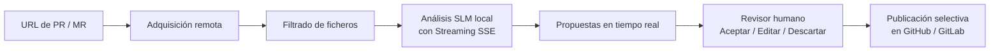

[English](README.md) | **Español**

# CodeReview AI

CodeReview AI es una aplicación web (SPA/PWA) para realizar revisiones colaborativas de código asistidas por modelos de lenguaje pequeños (SLMs) ejecutados exclusivamente en el equipo local.

La aplicación facilita la revisión de Pull Requests de GitHub y Merge Requests de GitLab —tanto en plataformas públicas como en entornos corporativos on-premise— combinando el análisis estático y asistido por IA con el criterio, la decisión y el control absoluto de los revisores humanos.

---

## ¿Qué beneficios aporta?

- **Detección temprana de riesgos**: Identifica problemas de diseño orientados a principios SOLID, defectos de calidad de código y vulnerabilidades de seguridad antes de integrar los cambios.
- **Privacidad y soberanía de datos**: El código fuente analizado nunca sale del equipo local; la inferencia se realiza mediante un runtime SLM local en `localhost`.
- **Intervención y control humano (*Human-in-the-loop*)**: Los comentarios generados por el SLM son propuestas sugeridas, nunca decisiones automáticas ni aprobaciones desatendidas.
- **Revisión granular**: Cada propuesta se vincula a un fichero y a un número de línea concreto, permitiendo aceptar, editar, publicar o descartar cada observación de forma individual.
- **Streaming en tiempo real**: Invocación progresiva al SLM que extrae y visualiza propuestas a medida que se generan, aislando el razonamiento previo (*thinking process*).
- **Persistencia local completa**: Guarda el expediente de revisión en el navegador (IndexedDB) para reanudar el trabajo en cualquier momento o trabajar offline.
- **Soporte multientorno**: Compatible con GitHub.com, GitHub Enterprise Server, GitLab.com y despliegues GitLab auto-alojados (self-hosted).

---

## Características Principales

### 1. Invocación SLM mediante Streaming y Gestión de Razonamiento
- **Streaming SSE (Server-Sent Events)**: Conexión mediante `/chat/completions` con `stream: true` para una respuesta reactiva e inmediata.
- **Aislamiento de razonamiento (*Reasoning / Thinking*)**: En modelos como DeepSeek-R1, Gemma 4, QwQ o Qwen, el cliente separa automáticamente el flujo de razonamiento (`reasoning_content` o bloques `<think>...</think>`) de la respuesta estructurada JSON, evitando que el pensamiento sature el límite de salida o corrompa el formato.
- **Extracción incremental de propuestas**: A medida que los objetos JSON individuales `{ "id": ..., "line": ... }` se completan en el stream, se validan y se visualizan en vivo sin tener que esperar a que finalice todo el fichero.
- **Resiliencia ante límites de tokens (`finish_reason: "length"`)**: Si el modelo agota su presupuesto de tokens (`maxTokens`), el sistema no descarta el análisis; recupera de forma tolerante todas las propuestas completadas previamente.
- **Contrato estructurado JSON**: Aplicación estricta de `json_schema` combinada con contrato textual obligatorio en el prompt del sistema.

### 2. Orquestación del Flujo con LangGraph
- **Grafo de estados formal**: Orquestación construida sobre `@langchain/langgraph` con persistencia de hilos (`thread_id`) y gestión de memoria mediante `MemorySaver`.
- **Fases del proceso**:
  1. `acquireReviewData`: Descarga y estructuración de ficheros, parches diff y comentarios remotos existentes.
  2. `analyzeWithLocalSlm`: Análisis iterativo de ficheros seleccionados con el SLM local y emisión en vivo de sugerencias.
  3. `waitForHumanReview`: Pausa deliberada del grafo para la toma de decisiones por parte del revisor humano (aceptar, editar, descartar, aprobar localmente o cerrar).

### 3. Filtrado Inteligente del Alcance de Revisión (*Review Scope*)
- **Detección de contenido relevante**: Selección automática de ficheros de código fuente y configuración analizables.
- **Exclusión automática**: Omite ficheros binarios, imágenes, lockfiles de dependencias (`package-lock.json`, `pnpm-lock.yaml`, `yarn.lock`), bundles minificados y assets estáticos, optimizando el contexto y la velocidad del análisis.

### 4. Persistencia Local con Dexie.js e IndexedDB
- **Almacenamiento transaccional**: Guarda en IndexedDB el expediente íntegro de la revisión: metadatos de la PR/MR, snapshots de ficheros, parches unificados, propuestas del SLM y comentarios humanos.
- **Control de estados de propuestas**: Registro del ciclo de vida de cada hallazgo (`pending`, `accepted`, `rejected`, `published`).
- **Métricas y KPIs**: Panel de control con indicadores de revisiones activas, comentarios pendientes de decisión y comentarios publicados.
- **Privacidad estricta**: Los tokens personales de acceso no se almacenan en la base de datos; residen únicamente en la memoria de la sesión.

### 5. Visor de Diferencias e Interfaz de Revisión
- **Navegación contextual**: Árbol de ficheros con indicación de estado (añadido, modificado, eliminado) y contador de propuestas por fichero.
- **Visor diff interactivo**: Visualización de líneas añadidas/eliminadas con marcadores de propuesta directamente en las líneas afectadas.
- **Categorías y severidades**:
  - **Categorías**: Principios SOLID (`solid`), Seguridad (`security`) y Calidad/Mantenibilidad (`quality`).
  - **Severidades**: `alta`, `media` y `baja`.
- **Acciones directas por propuesta**:
  - **Aceptar**: Confirma la propuesta para su posterior publicación.
  - **Editar**: Permite ajustar el mensaje y la recomendación sugerida por el SLM antes de enviarla.
  - **Publicar**: Envía el comentario a la API remota de GitHub o GitLab.
  - **Eliminar**: Descarta la propuesta localmente.

### 6. Sistema de Diagnóstico y Telemetría Local
- Registro de eventos y métricas de rendimiento en tiempo real (`trace`): tiempos de respuesta HTTP, recuento de caracteres de razonamiento vs. contenido, tokens generados, tasa de aciertos y motivos de finalización del stream.

---

## ¿Cómo funciona el flujo de revisión?



1. **Entrada de URL**: Se introduce la URL de la Pull Request (GitHub) o Merge Request (GitLab).
2. **Autenticación efímera**: Se introduce el token personal (PAT) en memoria si el repositorio es privado o si se publicarán comentarios.
3. **Adquisición**: La aplicación descarga metadatos, parches y comentarios remotos previos.
4. **Análisis SLM**: El runtime local procesa los ficheros en streaming, categorizando hallazgos en SOLID, seguridad y calidad.
5. **Revisión humana**: El usuario inspecciona el diff, evalúa las propuestas y decide individualmente sobre cada una.
6. **Publicación controlada**: Los comentarios aprobados se publican en el hilo remoto marcando claramente su procedencia asistida por IA.

> **Importante**: La aplicación nunca aprueba, cierra ni fusiona automáticamente Pull Requests o Merge Requests en la plataforma remota.

---

## Requisitos

- **Navegador**: Cualquier navegador moderno con soporte para ES Modules, IndexedDB y Web Streams API (Chrome, Edge, Firefox, Safari).
- **Runtime SLM local**: Un servicio compatible con la API de OpenAI accesible en `localhost`, por ejemplo:
  - [LM Studio](https://lmstudio.ai/)
  - [Ollama](https://ollama.com/)
  - [llama.cpp](https://github.com/ggml-org/llama.cpp)
  - [vLLM](https://github.com/vllm-project/vllm)
- **Credenciales Git**: Token de acceso personal (PAT) con permisos de lectura y escritura en la plataforma correspondiente (GitHub o GitLab).

---

## Configuración del SLM

Desde la pantalla de **Configuración** de la aplicación se gestionan los siguientes parámetros:

| Parámetro | Descripción | Valor por defecto |
| :--- | :--- | :--- |
| **URL local del runtime** | Endpoint base compatible con OpenAI. | `http://localhost:11434/v1` |
| **Modelo SLM** | Nombre del modelo cargado en el runtime. | `llama3.2` |
| **Temperatura** | Control de determinismo de la inferencia. | `0.2` |
| **Máximo de tokens** | Presupuesto máximo de salida (razonamiento + JSON). | `4096` |
| **Instrucciones de revisión** | Directrices de revisión personalizables (SOLID, seguridad, calidad). | Predefinidas |
| **Contrato de salida** | Esquema JSON bloqueado de solo lectura para asegurar compatibilidad. | Estricto |

> **Tip**: El botón de refresco (↻) junto al selector de modelos consulta el endpoint `/models` del runtime para listar automáticamente los modelos disponibles en tu entorno local.

---

## Privacidad y Seguridad

- **Cero telemetría externa**: Ningún dato de código, diffs ni propuestas se transfiere a proveedores de IA en la nube.
- **Tokens efímeros**: Los tokens de GitHub/GitLab solo viven en la memoria de la sesión activa del navegador; nunca se almacenan en `localStorage` ni en `IndexedDB`.
- **Runtimes locales protegidos**: La aplicación valida que la URL del SLM pertenezca estrictamente a `localhost` (`127.0.0.1` o `::1`).
- **Auditoría local**: Toda la información persistida puede eliminarse de forma manual e inmediata desde el expediente de la revisión.

---

## Instalación y Puesta en Marcha

Para ejecutar el proyecto en modo desarrollo local:

1. Clonar el repositorio:
   ```bash
   git clone git@github.com:Mordaft/codereview-ai-assisted.git
   cd codereview-ai-assisted
   ```

2. Instalar dependencias:
   ```bash
   npm install
   ```

3. Iniciar el servidor de desarrollo:
   ```bash
   npm run dev
   ```

4. Compilar para producción:
   ```bash
   npm run build
   ```

---

## Estado del Proyecto

La aplicación se encuentra en fase activa de desarrollo. Se han completado las capacidades de adquisición remota, persistencia transaccional local, orquestación mediante LangGraph, invocación en streaming con filtrado de razonamiento para SLMs y gestión humana de comentarios sobre diffs.
