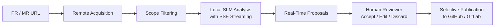

**English** | [Español](README.es.md)

# CodeReview AI

CodeReview AI is a web application (SPA/PWA) for collaborative code reviews assisted by Small Language Models (SLMs) running exclusively on your local machine.

The application streamlines reviewing GitHub Pull Requests and GitLab Merge Requests — across both public hosting platforms and on-premise enterprise environments — combining static and AI-assisted analysis with the judgment, decision-making, and full control of human reviewers.

---

## Key Benefits

- **Early Risk Detection**: Identifies architectural design issues against SOLID principles, code quality flaws, and security vulnerabilities before changes are merged.
- **Data Privacy & Sovereignty**: Analyzed source code never leaves your local workstation; inference runs via a local SLM runtime hosted on `localhost`.
- **Human-in-the-Loop Control**: Suggestions generated by the SLM are presented as advisory proposals, never as automated decisions or unattended approvals.
- **Granular Line-by-Line Review**: Each proposal is tied to an exact file and line number, allowing you to accept, edit, publish, or discard each observation individually.
- **Real-Time Streaming**: Progressive SLM streaming that extracts and displays proposals live as they are generated, isolating preliminary thinking/reasoning processes.
- **Full Local Persistence**: Saves the entire review dossier in the browser (IndexedDB) to resume work at any time or operate offline.
- **Multi-Environment Support**: Fully compatible with GitHub.com, GitHub Enterprise Server, GitLab.com, and self-hosted GitLab deployments.

---

## Core Features

### 1. Streaming SLM Invocation & Reasoning Management
- **SSE Streaming (Server-Sent Events)**: Connected to `/chat/completions` with `stream: true` for responsive, immediate output.
- **Reasoning Isolation (*Thinking Process*)**: When using reasoning models such as DeepSeek-R1, Gemma 4, QwQ, or Qwen, the client automatically separates thought output (`reasoning_content` or `<think>...</think>` tags) from structured JSON responses. This prevents thinking tokens from consuming the token budget or corrupting JSON syntax.
- **Incremental Proposal Extraction**: As individual JSON objects `{ "id": ..., "line": ... }` are completed within the stream, they are validated and rendered live without waiting for the full file analysis to complete.
- **Resilience Against Token Limits (`finish_reason: "length"`)**: If a model exhausts its token budget (`maxTokens`), the system does not discard the run; it recovers all fully completed proposals preceding the truncation point.
- **Structured JSON Contract**: Strict schema enforcement (`json_schema`) complemented by an immutable contract within the system prompt.

### 2. Workflow Orchestration with LangGraph
- **Formal State Graph**: Orchestration built on `@langchain/langgraph` featuring persistent review threads (`thread_id`) and checkpoint memory management with `MemorySaver`.
- **Pipeline Stages**:
  1. `acquireReviewData`: Fetches and structures remote files, unified diff patches, and existing remote comments.
  2. `analyzeWithLocalSlm`: Iteratively analyzes candidate files with the local SLM, streaming suggestions live.
  3. `waitForHumanReview`: Pauses execution for human reviewer intervention (accept, edit, discard, approve locally, or close).

### 3. Smart Scope Filtering (*Review Scope*)
- **Relevant Content Detection**: Automatically targets analysable source code and configuration files.
- **Automatic Exclusion**: Excludes binary files, images, dependency lockfiles (`package-lock.json`, `pnpm-lock.yaml`, `yarn.lock`), minified bundles, and static assets, optimizing LLM context window usage and processing speed.

### 4. Local Persistence with Dexie.js & IndexedDB
- **Transactional Storage**: Stores review dossiers locally in IndexedDB: PR/MR metadata, file snapshots, diff patches, SLM proposals, and human comments.
- **Proposal Lifecycle Management**: Tracks state for every observation (`pending`, `accepted`, `rejected`, `published`).
- **Metrics & KPIs**: Dashboard featuring active reviews, comments awaiting review decisions, and published comments.
- **Strict Privacy**: Personal access tokens are never persisted to disk or IndexedDB; they remain exclusively in active session memory.

### 5. Interactive Diff Viewer & Review Workspace
- **Contextual File Tree**: Hierarchical navigation with file status badges (added, modified, deleted) and per-file proposal counters.
- **Interactive Diff Viewer**: Inline rendering of added/removed lines with proposal markers mapped to specific lines.
- **Categories & Severity Levels**:
  - **Categories**: SOLID principles (`solid`), Security (`security`), and Quality/Maintainability (`quality`).
  - **Severity Levels**: `alta` (high), `media` (medium), and `baja` (low).
- **Direct Proposal Actions**:
  - **Accept**: Confirms the proposal for subsequent publishing.
  - **Edit**: Allows editing the message and suggested remediation prior to publication.
  - **Publish**: Pushes the comment directly to the remote GitHub or GitLab API.
  - **Delete**: Discards the proposal locally.

### 6. Local Diagnostics & Telemetry
- Real-time event tracing (`trace`): HTTP response latency, reasoning character count vs. final content length, generated token estimates, cache/parser hit rates, and stream termination reasons.

---

## How the Review Workflow Works



1. **Input URL**: Provide the Pull Request (GitHub) or Merge Request (GitLab) URL.
2. **Ephemeral Authentication**: Provide your Personal Access Token (PAT) in memory for private repositories or comment publishing.
3. **Acquisition**: The app downloads metadata, diff patches, and existing comments.
4. **SLM Analysis**: The local runtime processes files via streaming, categorizing findings into SOLID, security, and quality issues.
5. **Human Review**: Inspect the diff, evaluate proposals, and take individual actions on each item.
6. **Controlled Publication**: Approved comments are published to the remote thread, clearly marked as AI-assisted.

> **Important**: The application never automatically approves, closes, or merges Pull Requests or Merge Requests on the remote platform.

---

## Requirements

- **Browser**: Any modern browser supporting ES Modules, IndexedDB, and Web Streams API (Chrome, Edge, Firefox, Safari).
- **Local SLM Runtime**: An OpenAI-compatible API endpoint accessible on `localhost`, such as:
  - [LM Studio](https://lmstudio.ai/)
  - [Ollama](https://ollama.com/)
  - [llama.cpp](https://github.com/ggml-org/llama.cpp)
  - [vLLM](https://github.com/vllm-project/vllm)
- **Git Credentials**: A Personal Access Token (PAT) with read and write permissions on the target platform (GitHub or GitLab).

---

## SLM Configuration

The in-app **Settings** panel allows configuring:

| Parameter | Description | Default Value |
| :--- | :--- | :--- |
| **Local Runtime URL** | Base OpenAI-compatible endpoint URL. | `http://localhost:11434/v1` |
| **SLM Model** | Name of the active model loaded in the runtime. | `llama3.2` |
| **Temperature** | Controls output determinism. | `0.2` |
| **Max Tokens** | Maximum output token budget (reasoning + JSON). | `4096` |
| **Review Instructions** | Customizable review guidelines (SOLID, security, quality). | Preconfigured |
| **Output Contract** | Immutable, read-only JSON schema guaranteeing parser compatibility. | Strict |

> **Tip**: Click the refresh button (↻) next to the model selector to query `/models` and auto-discover models loaded in your local runtime.

---

## Privacy & Security

- **Zero External Telemetry**: No source code, diffs, or review proposals are sent to cloud AI providers.
- **Ephemeral Credentials**: GitHub/GitLab tokens only exist in active browser tab memory; they are never saved to `localStorage` or `IndexedDB`.
- **Localhost Validation**: The application strictly validates that the SLM runtime URL targets `localhost` (`127.0.0.1` or `::1`).
- **Local Audit & Erasure**: All persisted review data can be manually deleted at any time directly from the review view.

---

## Getting Started

To run the project locally in development mode:

1. Clone the repository:
   ```bash
   git clone git@github.com:Mordaft/codereview-ai-assisted.git
   cd codereview-ai-assisted
   ```

2. Install dependencies:
   ```bash
   npm install
   ```

3. Start the development server:
   ```bash
   npm run dev
   ```

4. Build for production:
   ```bash
   npm run build
   ```

---

## Project Status

The application is actively being developed. Core capabilities currently implemented include remote acquisition, transactional IndexedDB persistence, LangGraph orchestration, SSE streaming inference with reasoning isolation for local SLMs, and interactive human review on unified diffs.
